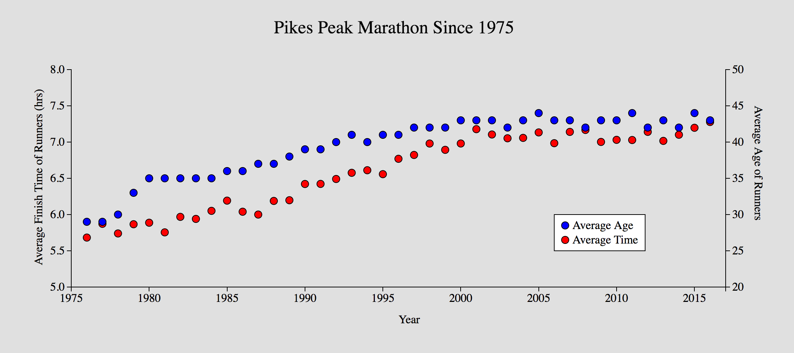
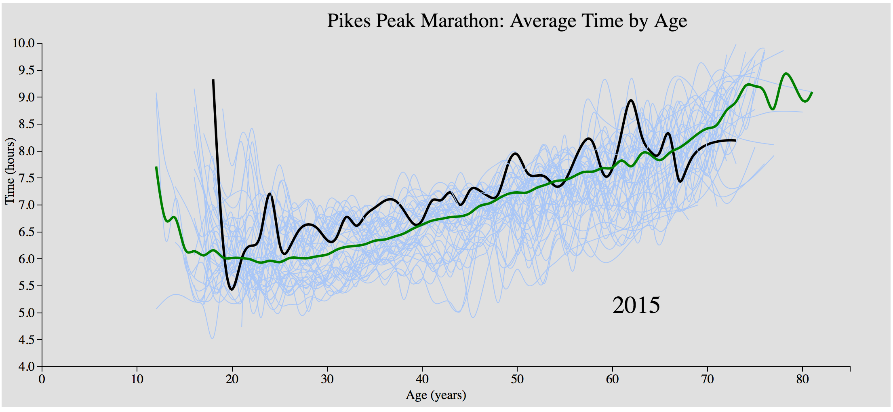
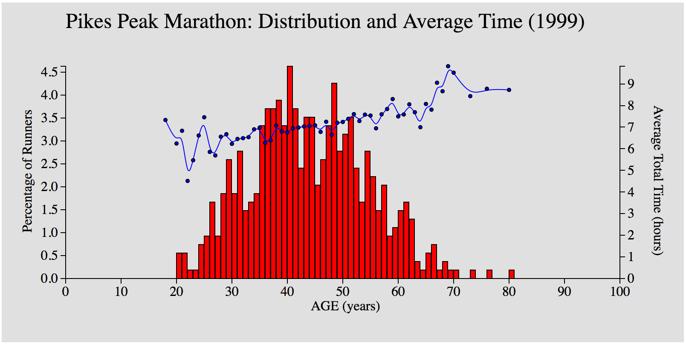
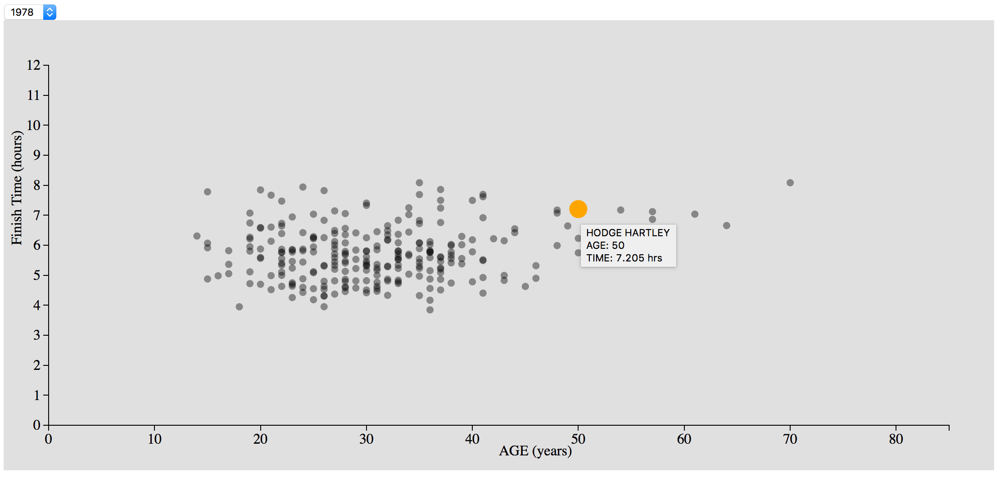
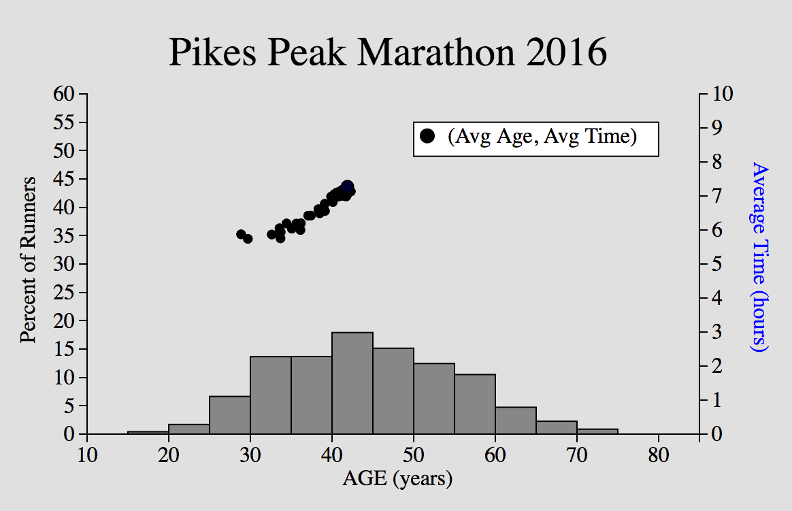
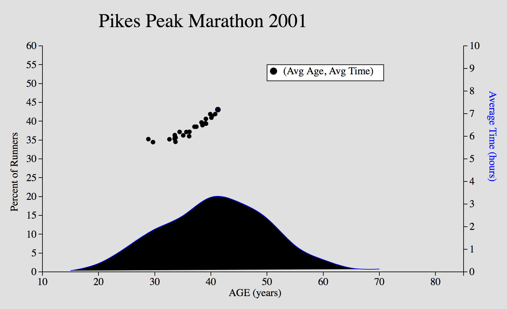
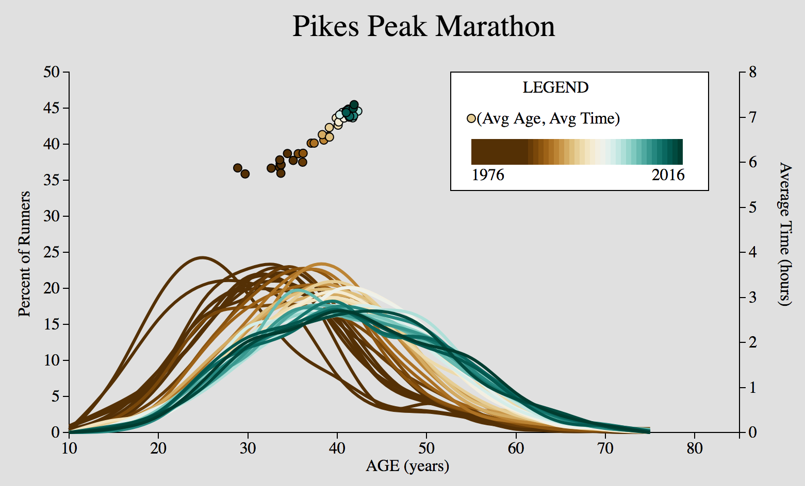

#Pikes Peak Marathon 

## Udacity Data Visualization With D3.js

Sections:

* <a href = "#WhyPP">Why Pikes Peak? </a>

* <a href = "#DataPrep"> Data Prep </a>

* Explorations and Iterations on Visualization Race Results

	* <a href = "#FirstVis"> First Exploration </a>
	* <a href = "#SecondVis"> Second Exploration </a> 
	* <a href = "#ThirdVis"> Third Visualization </a>
	* <a href = "#FourthVis"> Fourth Visualization </a>
	* <a href = "#FifthVis"> Fifth Visualization - First Iteration </a>
	* <a href = "#SixthVis"> Sixth Visualization </a>
	* <a href = "#SeventhVis"> Seventh Visualization </a>
	* <a href = "#EigthVis"> Eigth and Final Visualization </a>

<h2 id="WhyPP"> Why Pikes Peak? </h2>
The Pikes Peak Marathon is an 26.2 mile race in the front range of Colorado. The race begins in the downtown area of Manitou Springs where runners parade through the streets before shortly getting off the pavement and starting the ascent of Pikes Peak on trails.  Pikes Peak is a rather prominent mountain, reaching altitudes of over 14,000 feet.  Runners of the marathon must both ascend and descend the mountain on the same trail.  Not only battling the oxygen deprivation of altitude, but skirting around racers traveling in the opposite direction, presents its own challenge on sections of narrow trail above the 12,000 foot mark.  The race has a festival feeling as you reach the highest of altitudes on course and cheering spectators line the course to watch.  

I chose to work with data from the Pikes Peak Marathon for several reasons: the length of its history, the moderate size of each years participant pools, the rather selective nature of the race (so that the fitness level of each age would be less spread out), and because I had a few questions that were already interesting to me.  One in particular was whether or not he demographic has shifted over the years and if so, how this would affect average race finish times.  

<h3 id = "DataPrep"> The data that was gathered was scraped from <a href = "http://www.pikespeakmarathon.org"> here </a>  using Python with the packages "urllib" and "BeautifulSoup".  After scraping, there was much cleaning and preprocessing that had to be done to extract only the results table and format it correctly for processing.  The work and code can be found in <a href="./PP_Webscrape.ipynb"> PP_Webscrape.ipynb </a> for scraping and preprocessing and in <a href="./Data_Manipulation.ipynb">Data_Manipulation.ipynb</a> for manipulation of the individual records into variations including the age grouping the is used for the final visualization.   Since there were some exploratory visualizations, the final data set ended up begin different than the initial sets.

<h3 id="FirstVis"> First Exploration </h3>

The initial exploratory plot was just to see if there was any trending in age and/or finish time as the years progressed.  

Clearly, there is an overall trending in the data for the average age of participants to increase as well as the overall average finish time as one would expect with an increasing age profile in an athletic event such as this. (Live working script: <a href="./index_01.html">First</a>)

<h3 id="SecondVis"> Second Exploration </h3>

For the second visualization, I was trying to see how much variation there was with each year at each age and within each age for the various years.

Even among the more populated ages of 30-40 years, there was a large variability from year to year in the average finish time.  The more extreme ages showed the highest greatest variability, but as will be shown this is probably due to the small sample size of each age near the extremes.  As a reference the overall average finish time across the 30 years at each age is also shown in green and when a mouse-over is performed on each curve the year it corresponds to is displayed. (live working script: <a href="./index_02.html">Second</a>)

<h3 id="ThirdVis"> Third Visualization </h3>

<h3 id="FourthVis"> Fourth Visualization - Scatter Plot</h3>

I created this visualization so that I could use the year selector to thumb through the scatterplots of age and finish times for the various years.

<h3 id="FifthVis"> Fifth Visualization - First Iteration For Final Plot </h3>

<h3 id="SixthVis"> Sixth Visualization </h3>

<h3 id="SeventhVis"> Seventh Visualization </h3>

This visualization was to simplify the moving boxes that complicated the previous animation.  Instead plotting a smoothed distribution curve focuses the reader to notice the changes in the overall shape of the distribution as years increase and not what is happening to each individual age group. (live working script: <a href = "./index_07.html">Seventh</a>)

<h3 id="EigthVis"> Eigth and Final Visualization </h3>

The previous couple of plots again have too much going on and it is difficult to decipher what the plot is trying to get across to the reader since they must expend some effort to figure out that the animation is a chronological movie.  The diverging colors were chosen to make visual separation of the years easier. (live working script: <a href = "./index_08.html">Eigth</a>)

  </script>

